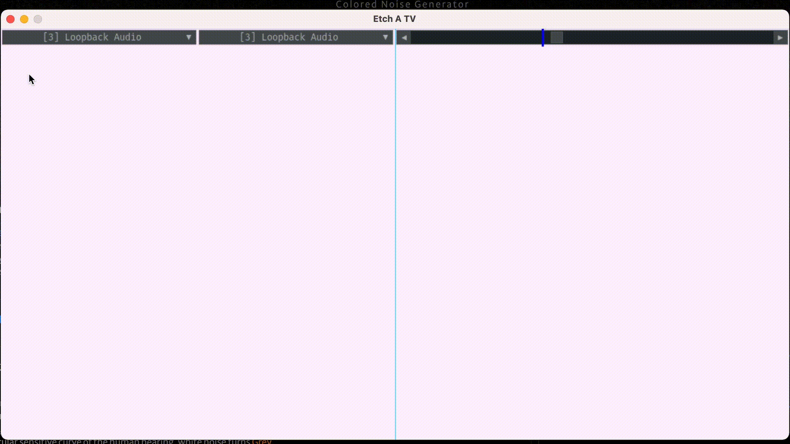

Etch-A-Tv
==
:bangbang: | Etch A TV is currently a work in progress. The code in this repo is horrible and is closer to a proof of concept than something that can be easily maintained.
:---: | :---
---
Etch A TV is a simple modem that uses two tones to represent an X and Y coordinate. This allows drawing simple images over radio. It's designed for ham radio use over 3khz SSB.



Install
--

```
pip3 install etch_a_tv
```

Running
--
If rigctld is listening etch_a_tv will use it to control PTT
```
rigctld -v &
etch_a_tv
```